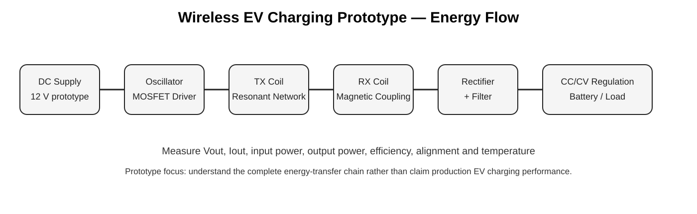
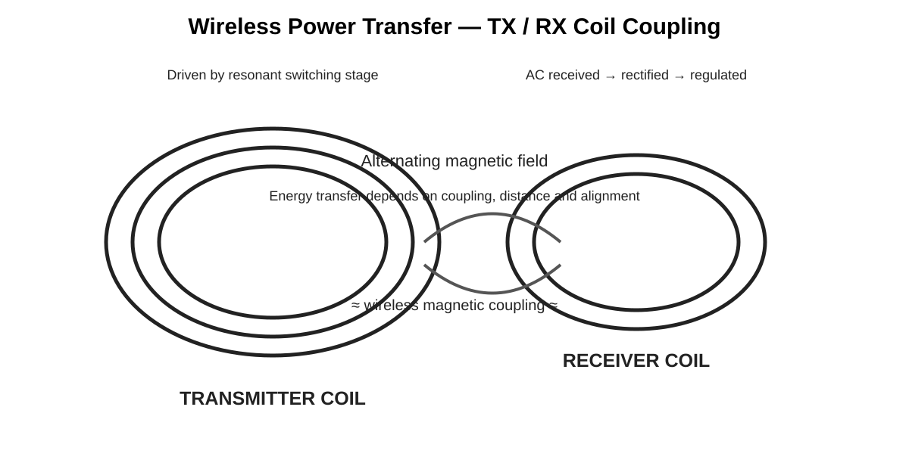
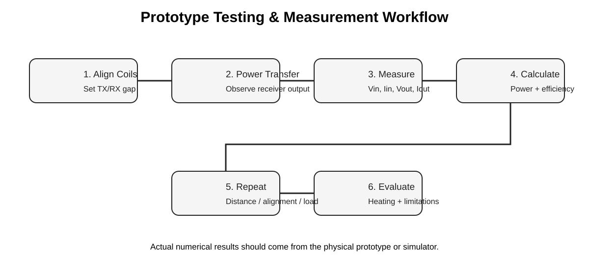

# Wireless EV Charging System — ECE Mini Project

> **Low-voltage wireless EV charging prototype using resonant inductive power transfer, transmitter/receiver coils, rectification, regulation and embedded monitoring.**



## 👋 Project Overview

I developed this **Wireless EV Charging System** as an Electronics & Communication Engineering mini project to understand how electrical energy can be transferred **without a direct charging connector**.

The project is a low-voltage educational prototype based on **resonant inductive power transfer**. My focus was understanding the complete energy-transfer chain: generating an alternating excitation, driving the transmitter coil, transferring energy magnetically to a receiver coil, converting the received AC into DC and regulating the output for a small demonstration load.

> **Scope:** This is an educational prototype, not a production EV charger. It must not be connected directly to an EV traction battery or mains voltage.

---

## 🎯 Objectives

- Build a proof-of-concept wireless energy-transfer system.
- Study electromagnetic induction and resonant coupling.
- Design and understand transmitter and receiver coils.
- Drive the transmitter coil using a switching stage.
- Receive energy through magnetic coupling.
- Convert received AC to DC using rectification.
- Filter and regulate the DC output.
- Study how coil distance and alignment affect power transfer.
- Monitor voltage/current in the prototype.
- Understand the engineering challenges involved in scaling wireless charging toward EV applications.

---

## ⚡ How My Project Works



The system works in six major stages:

### 1. DC input

A **12 V current-limited DC supply** is used for the low-voltage prototype.

### 2. High-frequency switching

A PWM/oscillator and MOSFET switching stage convert the DC input into an alternating excitation suitable for the transmitter resonant network.

### 3. Transmitter coil

The transmitter coil generates an alternating magnetic field. A resonant capacitor can be used with the coil to tune the network around the selected operating frequency.

### 4. Wireless magnetic coupling

When the receiver coil is positioned above the transmitter coil, part of the alternating magnetic field links the receiver coil and induces an AC voltage.

### 5. Rectification and filtering

The received AC is converted into DC using a fast/Schottky bridge rectifier and smoothed using filter capacitors.

### 6. Regulation and load

A buck or CC/CV regulator provides a controlled DC output for a small protected rechargeable battery or demonstration load.

---

## 🔌 Complete System Architecture

```text
                         TRANSMITTER SIDE

  12 V DC Supply
        │
        ▼
  PWM / Oscillator
        │
        ▼
  Gate Driver
        │
        ▼
  MOSFET Switching Stage
        │
        ▼
  TX Coil + Resonant Capacitor
        │
        ║
        ║  ALTERNATING MAGNETIC FIELD
        ║  ~~~~~ WIRELESS COUPLING ~~~~~
        ║
        ▼
  RX Coil + Resonant Capacitor
        │
        ▼
  Fast Bridge Rectifier
        │
        ▼
  Filter Capacitor
        │
        ▼
  CC/CV / DC-DC Regulator
        │
        ▼
  Battery / DC Load

                         OPTIONAL MONITORING

  Voltage Sensor ─┐
  Current Sensor ─┼──► Arduino / ESP32 ──► Serial / Display
  Temperature ────┘
```

A clean block diagram is also available at [`images/wireless-ev-charging-block-diagram.svg`](images/wireless-ev-charging-block-diagram.svg).

---

## 🧩 Components I Used / Considered for the Prototype

### Transmitter

| Component | Purpose |
|---|---|
| 12 V DC supply | Low-voltage prototype input |
| PWM / oscillator | Generates switching excitation |
| Logic-level N-channel MOSFETs | High-frequency switching |
| IR2110 or equivalent gate driver | MOSFET gate drive |
| Enamelled copper TX coil | Creates magnetic field |
| Polypropylene resonant capacitor | LC tuning |
| Fuse/protection | Input protection |
| Heat sink | Thermal management |

### Receiver

| Component | Purpose |
|---|---|
| Enamelled copper RX coil | Receives magnetic energy |
| Fast/Schottky bridge rectifier | AC → DC conversion |
| Filter capacitor | Smooths rectified output |
| DC-DC / CC-CV regulator | Controls output voltage/current |
| Protected rechargeable battery or electronic load | Demonstration load |
| Multimeter / voltage sensor | Measurement |
| Current sensor / ammeter | Current measurement |

> Component ratings and values must be selected from the actual measured coil inductance, switching frequency, expected current and thermal limits. The list above documents the prototype design approach; it is not a claim that every listed part number was used in the original hardware.

---

## 🌀 Coil Design

The transmitter and receiver can be implemented as flat spiral coils using enamelled copper wire.

The important parameters are:

- Number of turns
- Coil diameter
- Wire gauge
- Coil inductance
- Coil resistance
- Operating frequency
- Resonant capacitance
- Coupling coefficient
- Coil separation
- Coil alignment

### Resonant frequency

For an LC resonant network:

```text
             1
f₀ = ─────────────────
      2π √(L × C)
```

The actual capacitor should be selected after measuring the coil inductance and choosing a safe operating frequency.

---

## 📐 Energy Transfer Concept

The key principle is **Faraday's law of electromagnetic induction**.

The transmitter produces a changing magnetic field. The receiver coil experiences changing magnetic flux, which induces an AC voltage.

The system therefore converts:

```text
Electrical energy
       ↓
High-frequency magnetic field
       ↓
Induced electrical energy
       ↓
Rectified DC
       ↓
Regulated output
```


---

## 📊 What I Would Measure During Testing

I would evaluate the prototype under different coil gaps, alignment conditions and loads.

### Electrical measurements

- Input voltage `Vin`
- Input current `Iin`
- Receiver/output voltage `Vout`
- Output current `Iout`
- Input power `Pin`
- Output power `Pout`

### Physical measurements

- TX/RX coil gap
- Alignment offset
- MOSFET temperature
- Coil temperature
- Rectifier temperature

### Calculations

```text
Pin = Vin × Iin

Pout = Vout × Iout

Efficiency = (Pout / Pin) × 100
```



---

## 🧪 Testing Methodology

### Test 1 — Coil alignment

I would keep the vertical gap approximately constant and move the receiver coil laterally.

**Expected observation:** better alignment generally increases magnetic coupling and therefore increases received power.

### Test 2 — Coil separation

I would gradually increase the TX/RX distance.

**Expected observation:** received voltage and power generally decrease as coupling becomes weaker.

### Test 3 — Load variation

I would test several safe loads and compare `Vout`, `Iout`, `Pout` and efficiency.

### Test 4 — Thermal behaviour

I would monitor the MOSFETs, coils, rectifier and regulator during operation because losses can appear as heat.

---

## 📋 Experimental Results Template

I am intentionally leaving numerical values blank rather than inventing measurements.

| Coil Gap | Alignment | Vout | Iout | Pout | Efficiency |
|---:|---|---:|---:|---:|---:|
| 5 mm | Centered | — | — | — | — |
| 10 mm | Centered | — | — | — | — |
| 15 mm | Centered | — | — | — | — |
| 10 mm | Offset | — | — | — | — |

If you later find your original notebook/photos/measurements, these values can be added without changing the project structure.

---

## 🤖 Embedded Monitoring

An Arduino/ESP32 can be added as a monitoring layer to measure receiver voltage/current and temperature.

The repository contains:

`firmware/monitor.ino`

The firmware demonstrates low-voltage ADC measurement and serial reporting.

```text
Voltage Sensor ──┐
Current Sensor ──┼──► Arduino / ESP32 ──► Serial Monitor
Temperature ─────┘
```

The microcontroller should **not** be connected directly to high-power switching nodes. Proper sensing, isolation and protection are required.

---

## 💻 Firmware Example

The monitoring code reads the receiver voltage and current-sensor signal and sends the measurements through Serial.

Example output:

```text
Receiver Voltage: 8.42 V | Current ADC: 213
Receiver Voltage: 8.57 V | Current ADC: 218
Receiver Voltage: 8.51 V | Current ADC: 216
```

These example lines are **illustrative only**, not experimental results.

---

## 🧠 Main Engineering Challenges

### 1. Coil alignment

Wireless transfer is strongly affected by how accurately the TX and RX coils are aligned.

### 2. Distance

Increasing the gap reduces coupling and can reduce received power.

### 3. Resonance

The switching frequency and LC network need to be appropriately matched to the coil characteristics.

### 4. Switching losses

MOSFET conduction and switching losses can reduce efficiency and create heat.

### 5. Coil losses

Copper resistance and other losses can cause heating.

### 6. Rectifier losses

The receiver rectifier introduces voltage drop and power loss.

### 7. Thermal management

Continuous operation requires monitoring of the switching devices, coils, rectifier and regulator.

---

## 🏠 Why This Is Relevant to ECE

This project allowed me to combine multiple ECE concepts rather than working on only one circuit:

- Electromagnetic theory
- Analog electronics
- Power electronics
- Resonant circuits
- MOSFET switching
- Rectification
- DC regulation
- Sensors and measurement
- Microcontroller interfacing
- Troubleshooting

That combination is the main engineering value of the project.

---

## 🚗 From Prototype to Real EV Charging

A real wireless EV charger is substantially more complex than this mini project.

A production system would need:

- High-power converters
- Closed-loop resonance/control
- Vehicle-to-charger communication
- Coil alignment assistance
- Foreign-object detection
- Thermal protection
- Electrical isolation
- EMI/EMC engineering
- Ground-fault and over-current protection
- Battery-management integration
- Certified charging control
- Mechanical and electrical safety validation

So I present this project as a **low-voltage proof-of-concept that helped me understand the core technology**, not as a production EV charging system.

---

## 🗣️ How I Explain It in an Interview

### 30-second answer

> **“My ECE mini project was a low-voltage wireless EV charging prototype based on resonant inductive power transfer. I worked on understanding the transmitter and receiver coil arrangement, the switching stage, wireless magnetic coupling, rectification and DC regulation. The main parameters I studied were coil alignment, separation, resonance, power loss and temperature. The project helped me connect electromagnetic theory with practical power-electronics implementation.”**

### If they ask: “How does it work?”

> “A DC supply feeds a switching circuit that creates a high-frequency excitation for the transmitter coil. The transmitter produces an alternating magnetic field. The receiver coil captures part of that field and generates AC voltage. I then rectify and filter that AC and use a regulation stage to obtain controlled DC output for the prototype load.”

### If they ask: “What was the hardest part?”

> “The biggest practical challenge is coupling. Even small changes in coil alignment and distance can change the received power. Apart from that, switching losses, coil resistance, rectifier losses and temperature have to be considered.”

### If they ask: “What did you learn?”

> “I learned how electromagnetic induction, resonant circuits, MOSFET switching, rectification, filtering, regulation and measurement work together in one system. It also taught me that a theoretical wireless power-transfer concept becomes much more difficult when efficiency, heat, EMI and safety are considered.”

---

## 🔮 Future Improvements

- Closed-loop resonance tracking
- Automatic coil alignment detection
- Temperature monitoring and protection
- Foreign-object detection
- Improved efficiency optimization
- Wireless communication between vehicle and charger
- Better power-stage control
- Real-time monitoring dashboard
- Larger experimental dataset for efficiency vs. gap/alignment

---

## 📁 Repository Structure

```text
wireless-ev-charging-system/
│
├── docs/
│   ├── architecture.md
│   └── project-explanation.md
│
├── firmware/
│   ├── monitor.ino
│   └── README.md
│
├── hardware/
│   └── component-selection.md
│
├── images/
│   ├── wireless-ev-charging-block-diagram.svg
│   ├── coil-coupling-diagram.svg
│   ├── charging-process.svg
│   └── testing-workflow.svg
│
├── simulation/
│   ├── transmitter_receiver_notes.md
│   └── expected_waveforms.md
│
├── .gitignore
├── LICENSE
├── README.md
└── requirements.txt
```

---

## ⚠️ Project Boundary

This is an educational low-voltage prototype/reference implementation. It is **not a certified EV charging system**.

Do not connect the design directly to mains voltage, an EV traction battery or other high-power systems without a properly engineered and certified power stage, protection system and charging controller.

Numerical performance claims should always be based on actual hardware measurements or simulator results.

---

## 👨‍💻 Author

**Nithesh S**  
B.E. Electronics & Communication Engineering

GitHub: `nitheshstech-dev`

---

## 📄 License

MIT License
